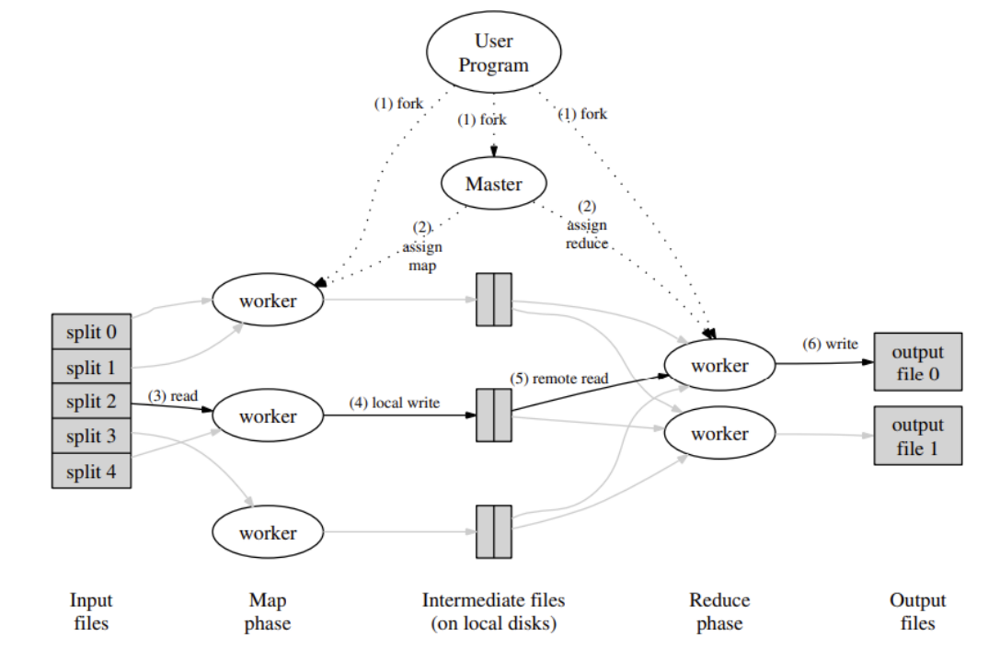

[MapReduce Paper](http://static.googleusercontent.com/media/research.google.com/en//archive/mapreduce-osdi04.pdf)

## Introduction

Here I steal the abstract from paper:

>   MapReduce is a programming model and an associated implementation for processing and generating large data sets. Users specify a map function that processes a key/value pair to generate a set of intermediate key/value pairs, and a reduce function that merges all intermediate values associated with the same intermediate key. Many real world tasks are expressible in this model, as shown in the paper.

Map: a function that processes a key/value pair to generate a set of intermediate key/value pairs.

Reduce: a function that merges all intermediate values associated with the same intermediate key.

Google build this MapReduce system includes a matured data management, machine cluster management, failure tolerant and managing the inter-machine communication, which can help user to run their MapReduce job in parallel and distributed system, allow uses to easily utilize the resources of a large distributed system.

The System Architecture of MapReduce System ↑

The execution flow:

1.   System will split the input file into M pieces. Then it stars up many copies of the program(worker) on a cluster of machines.
2.   

Some takeaways from the paper:

1.   ​	
2.   There are lots of points can not be ignored in real system, such as failure, network connections down, broken worker and workers recover after master discard it's task. All of these accidents happened daily, but we still can build a robust system based on a good design which considers the possible conditions.
3.   

Why MapReduce?

How MapReduce?

意思是Reduce Woker读到他被assign的所有文件后，他会像mrsequential.go里一样，把所有的文件读到内存里，按key(word)排序，然后遍历计算每个word的count

When a reduce worker has read all intermediate data, it sorts it by the

The sorting is needed because typically many different keys map to the same reduce task